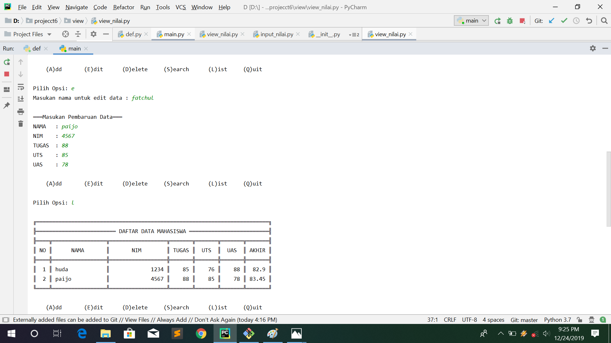

# 
.:Package & Module:.

1.main.py berisi program utama untuk memanggil semua module yang ada

2.daftar_nilai.py berisi modul untuk

tambah_data
ubah data
hapus data
cari data
3 view_nilai.py berisi modul untuk

cetak daftar nilai
cetak hasil pencarian
4 input_nilai.py berisi modul untuk meminta user menginputkan data

menambahkan:

list:

mencari:

mengedit:

menghapus

keluar

